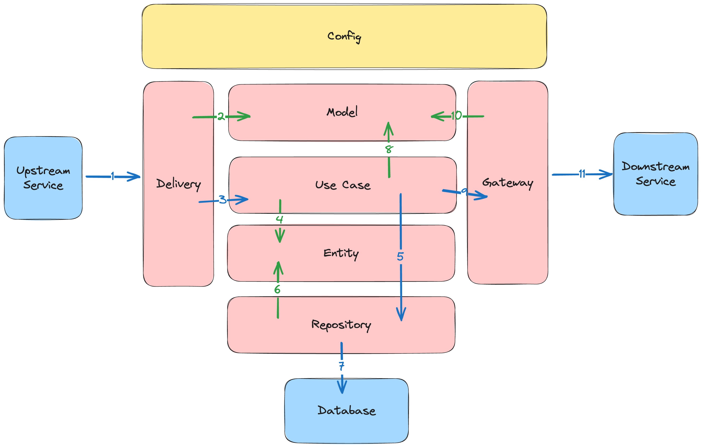

# Arsiva

> Backend service for **Arsiva** — a trivia game with visual novel experience, built for students.

## Architecture



This project follows **Clean Architecture** principles:

1. External system perform request (HTTP, gRPC, Messaging, etc)
2. The Delivery creates various Model from request data
3. The Delivery calls Use Case, and execute it using Model data
4. The Use Case create Entity data for the business logic
5. The Use Case calls Repository, and execute it using Entity data
6. The Repository use Entity data to perform database operation
7. The Repository perform database operation to the database
8. The Use Case create various Model for Gateway or from Entity data
9. The Use Case calls Gateway, and execute it using Model data
10. The Gateway using Model data to construct request to external system
11. The Gateway perform request to external system (HTTP, gRPC, Messaging, etc)

## Tech Stack

- Golang : https://github.com/golang/go
- PostgreSQL (Database) : https://github.com/postgres/postgres

## Framework & Library

- GoFiber (HTTP Framework) : https://github.com/gofiber/fiber
- PgxPool (Database Connection) : https://github.com/jackc/pgxpool
- Viper (Configuration) : https://github.com/spf13/viper
- Golang Migrate (Database Migration) : https://github.com/golang-migrate/migrate
- Go Playground Validator (Validation) : https://github.com/go-playground/validator
- Logrus (Logger) : https://github.com/sirupsen/logrus

## Configuration

All configuration is in `config.json` file.

## API Spec

All API Spec is in `api` folder.

## Database Migration

All database migration is in `db/migrations` folder.

### Create Migration

```shell
migrate create -ext sql -dir db/migrations create_table_xxx
```

### Run Migration via Makefile

| Command | Description |
|---|---|
| `make migrate` | Apply all pending migrations |
| `make migrate-down` | Rollback all migrations |
| `make migrate-fresh` | Reset & re-run all migrations from scratch |

## Run Application

### Run unit test

```bash
go test -v ./test/
```

### Run web server

```bash
go run cmd/web/main.go
# or
make start
```

### Dokumentasi API

[](https://petstore.swagger.io/?url=https://raw.githubusercontent.com/ArthaFreestyle/Arsiva/main/docs/openapi.yaml)

Silakan lihat dokumentasi API kami di sini: 
[👉 Buka Dokumentasi API Arsiva (Swagger UI)](https://petstore.swagger.io/?url=https://raw.githubusercontent.com/ArthaFreestyle/Arsiva/59b3ea9f6b46afc84e57e8d66bf20f570c95e1f7/docs/openapi.yaml)
